# Atividade Docker + CI — Geandria de Menezes Pereira

> Preencha todos os campos marcados com `[...]` e substitua os prints de exemplo pelos seus. Salve as imagens em `docs/imagens/` e mantenha os nomes de arquivo indicados.

**Aluno(a):** Geandria de Menezes Pereira
**Turma:** Noturno
**Data:** 27/07/2026 
**Aplicação usada:** docker/getting-started-app — To-Do em Node.js

**Sobre o app:**
- Runtime: Node.js 18+
- Início: `node src/index.js`
- Porta interna: `3000`
- Banco padrão: SQLite (`/etc/todos/todo.db`)
- Banco alternativo: MySQL, via variáveis `MYSQL_HOST`, `MYSQL_USER`, `MYSQL_PASSWORD`, `MYSQL_DB`
- API: `GET /items`, `POST /items`

---

## 1. Como executar este projeto

```bash
git clone https://github.com/andriamenezes/meu-projeto-docker
cd meu-projeto-docker
cp .env.example .env
docker compose up -d --build
```

**Acesse:** http://localhost:3000

**Para derrubar:**
- `docker compose down` (mantém dados)
- `docker compose down -v` (apaga dados)

---

## 2. Imagem e Dockerfile multi-stage

**Estágios utilizados:** builder (instala dependências) e estágio final (runtime enxuto)

**Imagem base:** node:20-alpine (nos dois estágios)

**Usuário de execução:** node (não-root)

**Tamanho final da imagem:** 67.9MB

**Por que o multi-stage ajuda?** 

Dockerfile com dois estágios: `builder` (instala apenas dependências de produção com `npm ci --omit=dev`) e o estágio final, que copia seletivamente `node_modules`, `package.json` e `src` do builder — sem devDependencies e sem os arquivos de teste. Ao copiar só os artefatos necessários para o estágio final, a imagem não carrega ferramentas de build nem devDependencies, ficando menor e com menos superfície de ataque.

### Print 1 — build + docker images

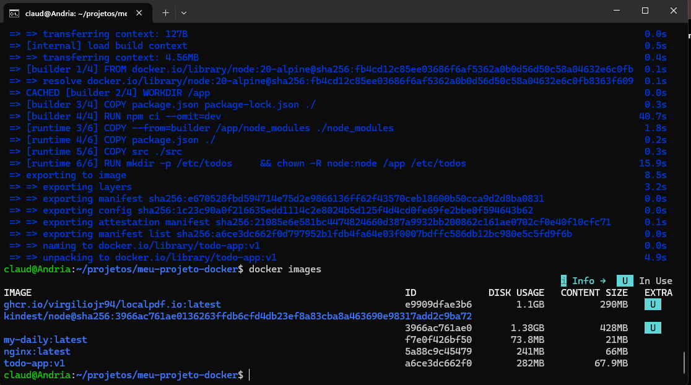

### Print 2 — aplicação rodando com tarefas cadastradas

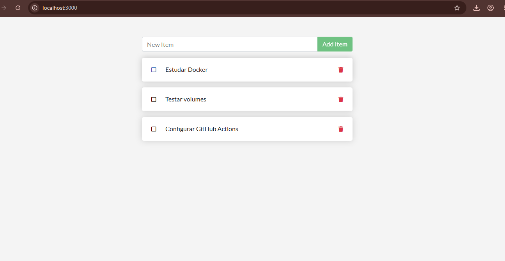

---

## 3. Volumes e persistência

**Volume usado:** `todo-db` → montado em `/etc/todos` (onde o SQLite grava `todo.db`)

### Print 3 — SEM volume: dados perdidos ao recriar o container

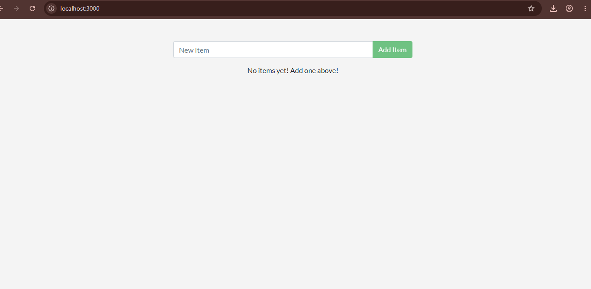

### Print 4 — COM volume: dados preservados

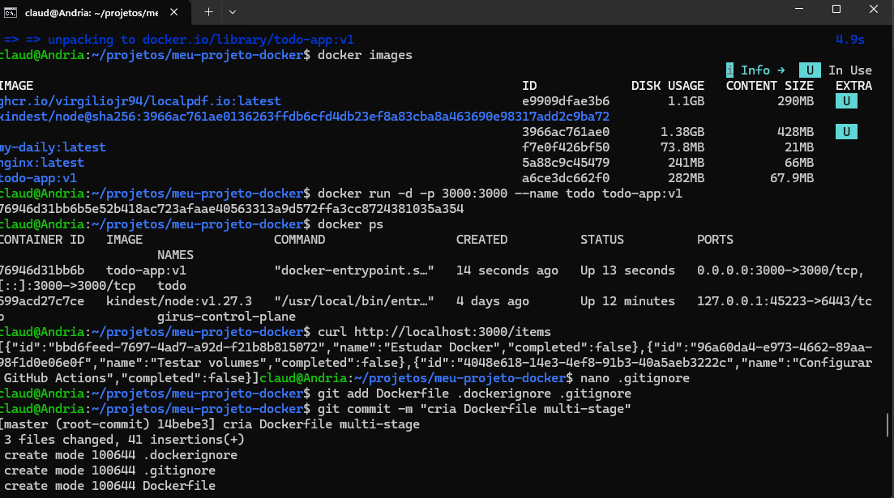

**Exemplo de volumes nomeados:**

```
DRIVER    VOLUME NAME
local     d2fc558a958805b95f2bb1826dd60ac3e1d3c57b2bc998ed6a9a0f5b3ae1e12e
local     todo-db
```

**Diferença entre `docker compose down` e `docker compose down -v`:**

O primeiro remove containers e rede mas mantém os volumes nomeados (dados preservados); o segundo também remove os volumes, apagando os dados.

---

## 4. Rede

**Rede criada:** `todo-net`

**Serviços conectados:** app e db

**A porta do banco está exposta ao host?** Não — O banco está acessível apenas pelos containers conectados à mesma rede Docker, o que reduz a exposição externa e melhora a segurança.

**Por que o app consegue chamar o host `mysql` / `db` sem saber o IP?**

Porque o Docker possui um DNS interno que resolve automaticamente o nome do container ou do serviço para o endereço IP correspondente dentro da mesma rede.

### Print 5 — docker network inspect

`docker network inspect todo-net`:

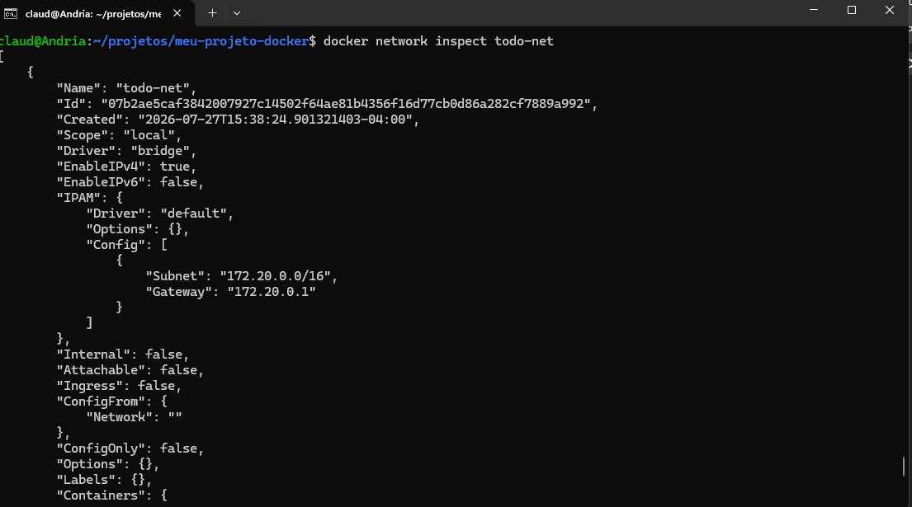

### Print 6 — dados dentro do MySQL (select * from todo_items;)

`select * from todo_items;` dentro do MySQL:

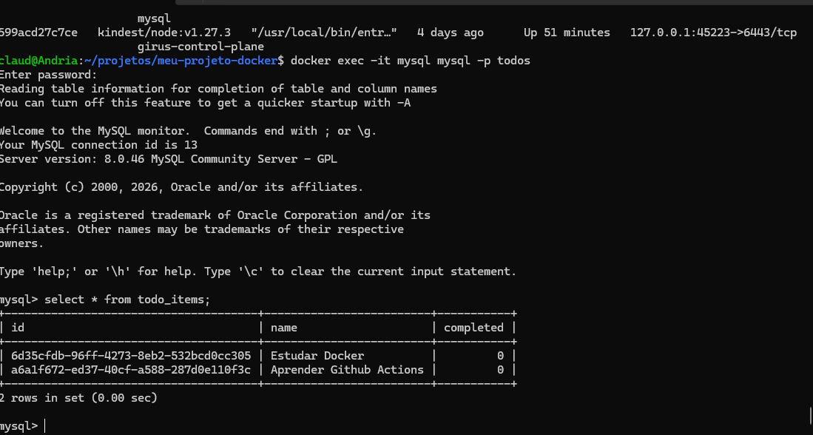

---

## 5. Docker Compose

**Serviços:** app, db

**Rede:** `todo-net`

**Volume:** `todo-mysql-data` (dados do MySQL em `/var/lib/mysql`)

**Healthcheck em:** db

**depends_on com:** condition: service_healthy

**Variáveis sensíveis:** carregadas via `.env` (não versionado). Modelo em `.env.example`.

### Print 7 — docker compose ps

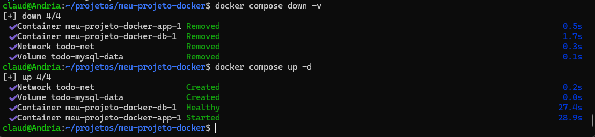

**Teste de persistência:**


---

## 6. Integração Contínua (GitHub Actions)

**Arquivo do workflow:** `.github/workflows/ci.yaml`

**Gatilhos:** push e pull_request

**O que o pipeline faz:**

1. Valida o `compose.yaml` (`docker compose config`)
2. Builda a imagem do serviço `app`
3. Sobe a stack (`docker compose up -d`)
4. Aguarda a aplicação responder e roda o smoke test do CRUD via API
5. Derruba a stack (`docker compose down -v`)

### Print 8 — execução verde ✅

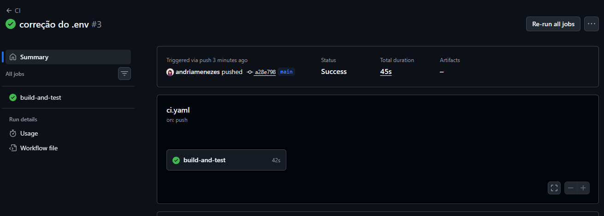

---

## 7. Quebra proposital do CI

**O que eu quebrei:** colocado caminho errado no .env

**Erro que apareceu no log:** 

Error: Process completed with exit code 1.

**Como o CI reagiu:** 

Na hora de "Esperar a aplicação responder" em actions deu bug, falhando no step de validação da aplicação.

**Como eu corrigi:** Corrigido a linha do comando .env

**Link do Pull Request:** https://github.com/andriamenezes/meu-projeto-docker/pull/1

### Print 9 — execução vermelha ❌ + log do erro

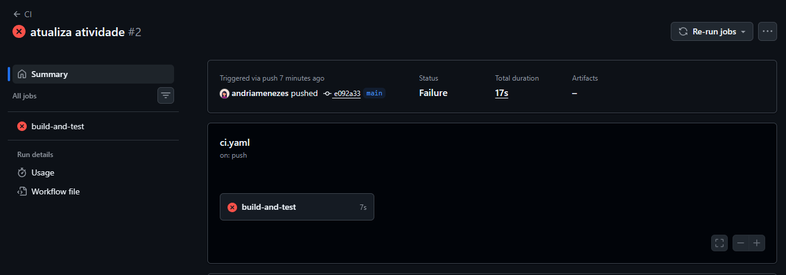

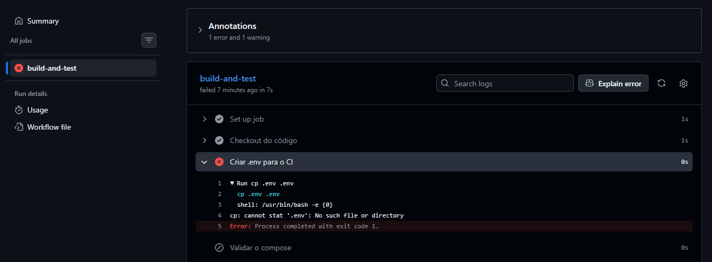


---

## 8. Dificuldades e aprendizados

Complexo o passo a passo, senti mais dificuldade com linux do que com o docker, aprendizagem leve e intuitiva. Aos poucos vamos memorizando e revendo os comandos, entendendo os conceitos, como um quebra cabeças, uma hora encaixa.
---

## 9. Checklist de autoavaliação

- [x] Dockerfile multi-stage funcionando
- [x] `.dockerignore` presente
- [x] Container não roda como root
- [x] Volume nomeado + persistência demonstrada
- [x] Rede nomeada + banco não exposto ao host
- [x] `docker-compose.yaml` sobe tudo com um comando
- [x] `.env` no `.gitignore` e `.env.example` versionado
- [x] CI verde
- [x] PR com CI vermelho documentado
- [x] Todos os 9 prints no README

## CD — Publicação no Docker Hub

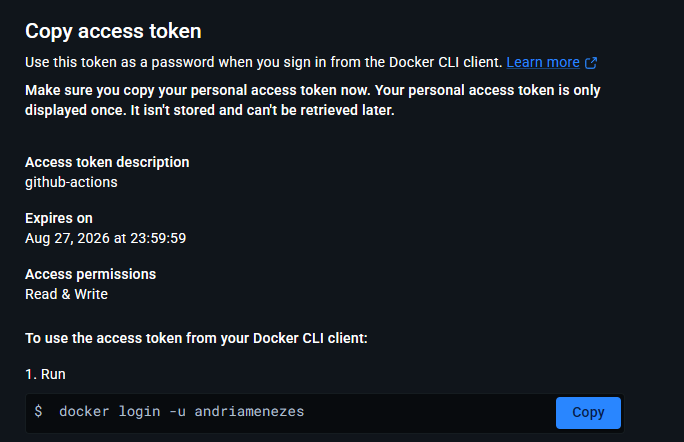
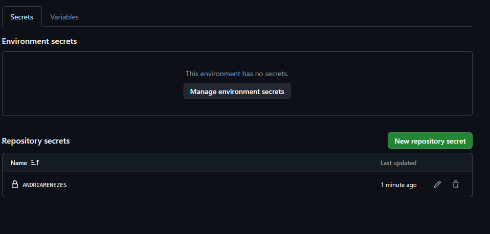
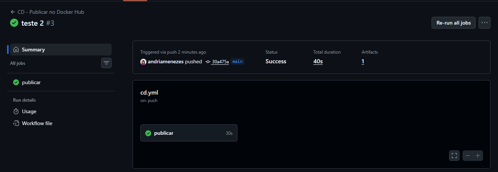
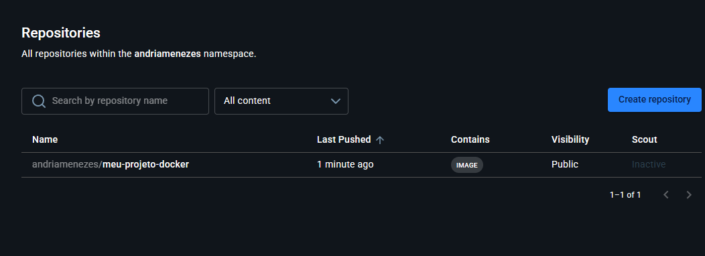
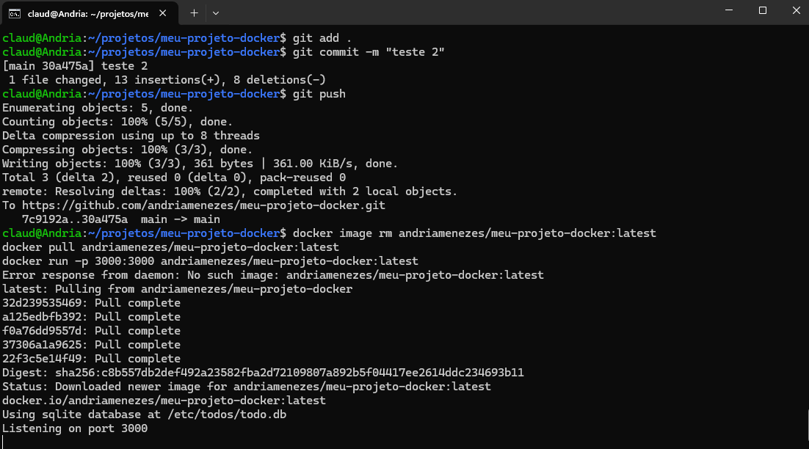

**Imagem publicada:** `SEU_USUARIO/meu-projeto-docker:latest`

### Perguntas

**1. O que é o Docker Hub, na sua visão?**
> (escreva sua resposta aqui)

**2. Qual a diferença entre o CI (atividade anterior) e o CD (esta)?**
> (escreva sua resposta aqui)

**3. Por que usamos um token e Secrets em vez de escrever o usuário e a senha no arquivo `cd.yml`?**
> (escreva sua resposta aqui)

**4. O que significa a tag `latest` no endereço da imagem?**
> (escreva sua resposta aqui)
